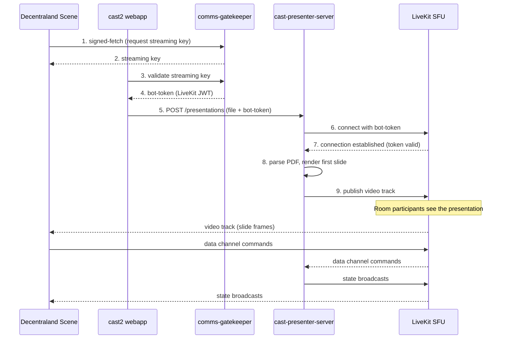
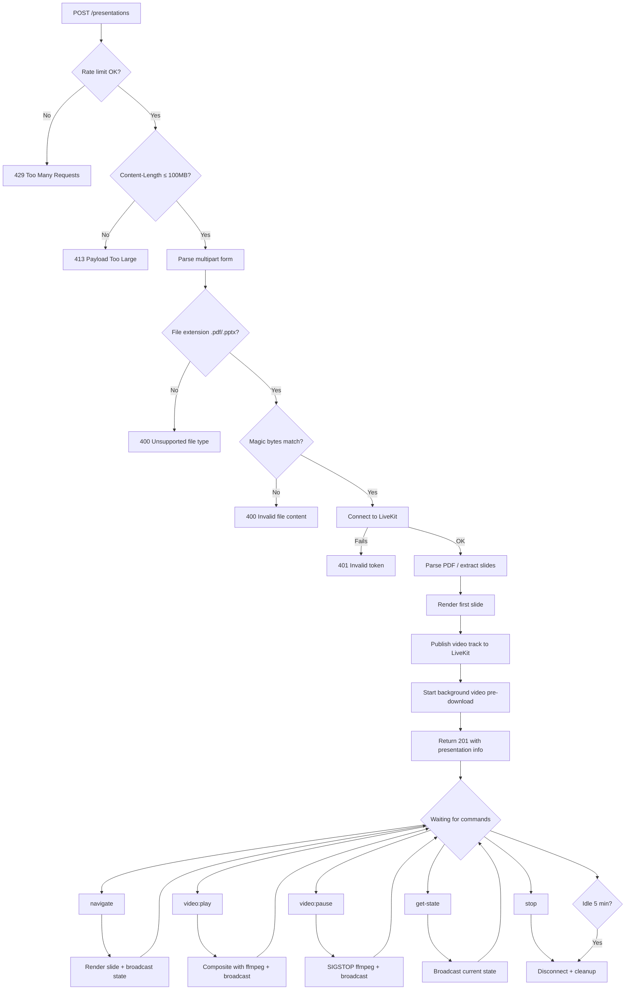

# Architecture

Cast Presenter Server renders presentation slides as a live video
stream and publishes them to a LiveKit room. This document covers
the system architecture, data channel protocol, session lifecycle,
and security model.

## System overview

The following diagram shows how a presentation is created and
streamed to participants.



## Workflow diagram

This diagram shows the internal processing flow when the server
handles a presentation request.



## Components

The server is built with the well-known-components pattern.
Each component is created during initialization and injected into
handlers.

| Component | Purpose |
|-----------|---------|
| `config` | Environment variable resolution with fallback chain |
| `logs` | Structured JSON logging with tracing |
| `server` | HTTP server with CORS and security headers |
| `metrics` | Prometheus metrics registry |
| `fetcher` | Traced HTTP client for outbound requests |
| `presentationManager` | Core business logic and session management |

### Adapters

Adapters wrap external systems and provide clean interfaces to the
presentation manager.

- **PDFRenderer:** Parses PDF/PPTX files using pdfjs-dist, renders
  slides to RGBA buffers using @napi-rs/canvas, and extracts video
  annotations with geometry information.
- **LiveKitPublisher:** Connects to a LiveKit room, publishes a
  video track from raw RGBA frames, handles data channel message
  routing, and manages bot metadata.
- **VideoCompositor:** Downloads videos (with SSRF protection),
  transcodes them with ffmpeg, and composites video frames onto
  slide backgrounds for real-time overlay playback.

## Session lifecycle

Each presentation runs as an in-memory session identified by a UUID.

1. **Create:** The server connects to LiveKit first (validating the
   token), then parses the PDF, renders the first slide, and starts
   publishing a video track.
2. **Pre-download:** In the background, all video URLs across all
   slides are downloaded and optionally pre-transcoded.
3. **Navigate:** Stops any active video, renders the target slide,
   forces a high-quality keyframe, and broadcasts updated state.
4. **Play video:** Loads or streams the video, composites it onto
   the slide canvas using ffmpeg, and pushes frames to LiveKit.
5. **Pause/Resume:** Sends SIGSTOP/SIGCONT to the ffmpeg process.
6. **Stop:** Disconnects from LiveKit, destroys the PDF renderer,
   cleans up the temporary directory, and removes the session.
7. **Idle cleanup:** A periodic check (every 60 seconds) terminates
   sessions with no remote participants for 5 minutes.

## Data channel protocol

The bot communicates with Decentraland scenes through LiveKit data
channels on the `presentation` topic. Messages are UTF-8 JSON
strings sent with reliable delivery.

### Commands (scene to bot)

```json
{ "type": "presentation:navigate", "action": "next" }
{ "type": "presentation:navigate", "action": "prev" }
{ "type": "presentation:navigate", "action": "goto", "slideIndex": 3 }
{ "type": "presentation:video:play", "videoIndex": 0 }
{ "type": "presentation:video:pause" }
{ "type": "presentation:stop" }
{ "type": "presentation:get-state" }
```

### State broadcast (bot to all participants)

After every state mutation and in response to `get-state`, the bot
broadcasts:

```json
{
  "type": "presentation:state",
  "id": "uuid",
  "fileName": "Quarterly Review",
  "currentSlide": 2,
  "slideCount": 15,
  "fileType": "pdf",
  "slideVideos": [
    {
      "url": "https://drive.google.com/...",
      "geometry": { "x": 100, "y": 200, "width": 640, "height": 360 }
    }
  ],
  "videoState": "idle"
}
```

The state is also stored in the bot's LiveKit participant metadata
so late joiners can read it immediately without waiting for a
broadcast.

### Authorization

Commands are accepted only from participants whose
`metadata.role` matches one of the configured `ALLOWED_COMMAND_ROLES`
(default: `presenter`, `streamer`, `presentation`). The role is set
by comms-gatekeeper when issuing tokens.

> **Note:** A planned comms-gatekeeper change will set
> `canUpdateOwnMetadata=false` for watchers and add server-side
> presenter promotion. Until then, any room participant can
> self-assign a presenter role.

### Bot identity

The bot's LiveKit participant identity starts with
`presentation-bot:` (for example,
`presentation-bot:scene:realm:sceneId:1234567890`). Scenes detect
the bot by this prefix to display presentation controls.

## Security model

### Authentication

The server doesn't have the LiveKit API secret. Authentication is
implicit: if the LiveKit connection succeeds, the token is valid
(issued by comms-gatekeeper, verified by the LiveKit SFU). If
connection fails, the request is rejected before any file processing.

### MITM protection

LiveKit tokens are sent in the `POST /presentations` request body.
In production, the server must run behind a TLS-terminating reverse
proxy to protect tokens in transit.

### Input validation

- **File size:** 100 MB maximum, checked via Content-Length header
  and busboy stream limits.
- **Magic bytes:** PDF files must start with `%PDF`, PPTX files
  must start with `PK\x03\x04` (ZIP header).
- **Filename sanitization:** `path.basename()` plus special
  character stripping.
- **File type:** Only `.pdf` and `.pptx` extensions are accepted.

### SSRF protection

Video URLs extracted from PDF annotations are validated before
download:

- Protocol must be `https://`.
- Domain must be in the allowlist: `drive.google.com`,
  `drive.usercontent.google.com`, `docs.google.com`,
  `youtube.com`, `youtu.be`, `vimeo.com`.
- DNS resolution is checked to block private IP ranges
  (127.0.0.0/8, 10.0.0.0/8, 172.16.0.0/12, 192.168.0.0/16,
  169.254.0.0/16).

### Download limits

- Maximum video download size: 500 MB.
- Download timeout: 60 seconds.

### Rate limiting

Per-IP in-memory rate limiters:

- `POST /presentations`: 5 requests per minute.
- `GET /api/drive-video`: 30 requests per minute.

### Drive proxy allowlist

The `DRIVE_VIDEO_ALLOWED_FILE_IDS` configuration uses a default-deny
posture. If the variable is empty or unset, all requests to
`/api/drive-video` are denied.

### Security headers

All responses include:

- `X-Content-Type-Options: nosniff`
- `X-Frame-Options: DENY`
- `Strict-Transport-Security: max-age=31536000; includeSubDomains`

### Container hardening

The Docker image runs as a non-root user (`appuser:1001`) and uses
Tini as PID 1 for proper signal handling.
